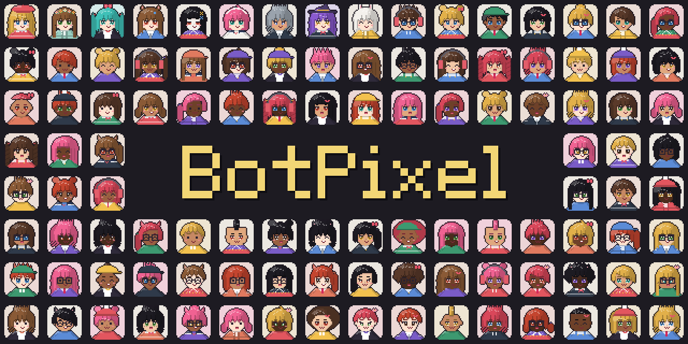
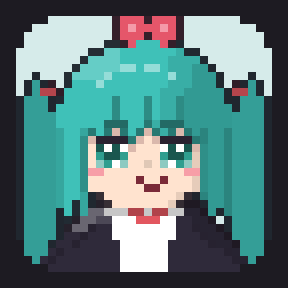
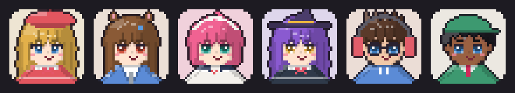
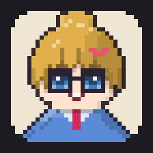

<p align="center"></p>

# BotPixel

Pixel art that changes shape. Two small, dependency-free packages from [BotHarness](https://github.com/BotHarness/BotHarness):

| Package                                       | What it does                                                                                                                                                                      |
| --------------------------------------------- | --------------------------------------------------------------------------------------------------------------------------------------------------------------------------------- |
| [`@botharness/pixel-morph`](packages/morph)   | Morphs any set of pixels into any other: every pixel hops along a short arc to a partner and snaps to the grid. Works on plain `{ x, y, c }` cells, so it is not tied to avatars. |
| [`@botharness/pixel-avatar`](packages/avatar) | Seeded, editable 32×32 chibi pixel avatars, plus 16 state symbols (thinking, reading, editing, searching…) the avatar can morph into while an agent works.                        |

```bash
npm install @botharness/pixel-avatar
```

```ts
import {
  faceCells,
  pixelAvatarSvg,
  pixelSymbolCells,
  seededRecipe,
} from '@botharness/pixel-avatar';
import { morphPixels } from '@botharness/pixel-morph';

const recipe = seededRecipe('DeepSeekBot'); // same name, same face, everywhere
element.innerHTML = pixelAvatarSvg(recipe);

// while a tool runs, turn the face into its symbol and back
const layer = element.querySelector<SVGGElement>('[data-avatar-pixel-morph]')!;
await morphPixels(layer, faceCells(recipe), pixelSymbolCells('search', recipe.hairColor), 800)
  .finished;
```

<p align="center"></p>

While an agent works, its avatar becomes the tool it is using, pixel by pixel, and turns back into a face when the turn ends. Several bots each follow their own tool:

<p align="center"></p>

## How the morph works

1. **Pair.** Both pixel sets are sorted by angle around their own centroid, then matched by proportional index. Neighbours fly to neighbours, and the smaller set is reused, so pixels split or merge instead of popping.
2. **Fly.** Each pair eases (`easeInOutCubic`) from start to end, hopping by `sin(kπ)·arc`, starting in 4×4 clumps from the top rows down.
3. **Snap.** Every frame rounds to whole grid cells and switches colour halfway, so it stays pixel art the whole way.

The engine does not know what it is drawing. Here it morphs one generated face straight into the next:

<p align="center"></p>

`planPixels` and `pixelFrame` are pure functions, so frames can be rendered offline (video, GIF, canvas) as well as with `morphPixels` in the browser.

## Custom avatars

Pass `{ mouthLayers: true }` to `pixelAvatarSvg` or `pixelFigure` to opt into speech features. Each head pose contains four `[data-avatar-mouth]` groups: `saved`, `closed`, `half-open`, and `open`. Show one state in every pose at a time; return to `saved` when speech ends or is cancelled. Layers include shared brows, nose and cheeks so their paint order stays exact. Eyes, blink, glasses and head turns remain independent. Text pacing and reduced-motion policy belong to the consuming app. Without the option, every existing output stays byte-for-byte unchanged; recipes and saved snapshots do not change.

A recipe is plain JSON (`head`, `hair`, `eyes`, `outfit`, `accessory`, colours…). `AVATAR_PARTS`, `AVATAR_SWATCHES` and `AVATAR_PRESETS` list every option, so an app can build its own avatar editor on top; `isPixelAvatarRecipe` validates what users save.

Hosts add their own state symbols with `symbolArtCells(rows, color)`, which draws 24×24 character art (`A` body, `H` highlight) in the built-in style.

## Contributing

```bash
pnpm install
pnpm verify   # format, lint, typecheck, test
pnpm build
pnpm assets  # re-render the README banner and GIFs (needs ffmpeg)
```

- New eyes, brows, mouths and symbols are character art: add rows, and the diff shows the picture.
- `packages/avatar/test/fixtures/botharness-golden.json` locks the output of every existing option and seed. Saved avatars must not change, so a PR that breaks it needs a new recipe version, not a new fixture.

## License

MIT
