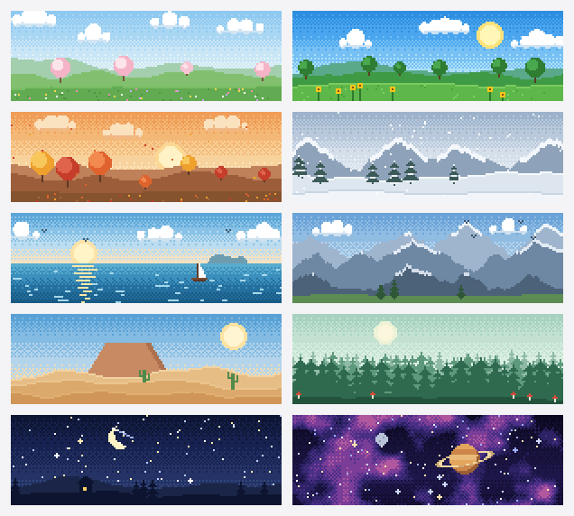
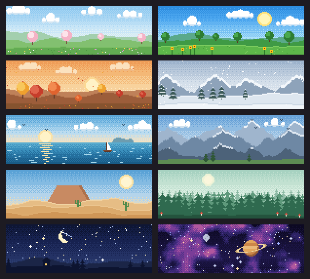

# BotPixel

会变形的像素画。来自 [BotHarness](https://github.com/BotHarness/BotHarness) 的三个零依赖小包：

- **`@botharness/pixel-morph`**：任意一组像素变成另一组像素。每个像素按极角配对，沿小弧线跳到目标，并始终对齐网格。只认 `{ x, y, c }`，不限于头像。
- **`@botharness/pixel-avatar`**：按名字生成、可编辑的 32×32 Q 版像素头像，加上 16 个状态符号（思考、读文件、编辑、搜索……），Agent 工作时头像可以变形成这些符号。
- **`@botharness/pixel-banner`**：按名字生成的 3:1 像素自然风景横幅，用作资料页头图。共十个场景（春、夏、秋、冬、海、山、沙漠、森林、星空、太空），输出 1500×500 RGBA。

用法、原理和贡献方式见 [README.md](README.md)。

## 资料页横幅

`seededBannerRecipe(name)` 按名字选出场景和种子；`pixelBannerImage(recipe)` 返回 1500×500 的 RGBA 像素，由 150×50 的原图整数放大 10 倍，不做平滑。全部场景在浅色和深色页面上的效果：

 

## 说话嘴型

给 `pixelAvatarSvg` 或 `pixelFigure` 传入 `{ mouthLayers: true }`，即可按需生成嘴型图层。每个转头角度都包含四组 `[data-avatar-mouth]`：`saved`（原本的表情）、`closed`（闭合）、`half-open`（半开）、`open`（张开）。每个角度同时只显示一个状态；说话结束或取消时恢复 `saved`。图层保留共享的眉毛、鼻子和脸颊，以维持原有像素绘制顺序；眼神、眨眼、眼镜和转头保持独立。文本节奏与减少动效策略由使用方负责。不启用该选项时，现有输出逐字节保持不变，配方与已保存的快照不变。

已保存的头像不能变：`packages/avatar/test/fixtures/botharness-golden.json` 锁住了每个选项和种子的输出。
